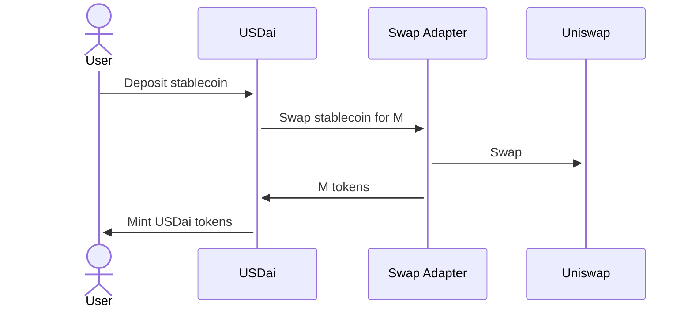
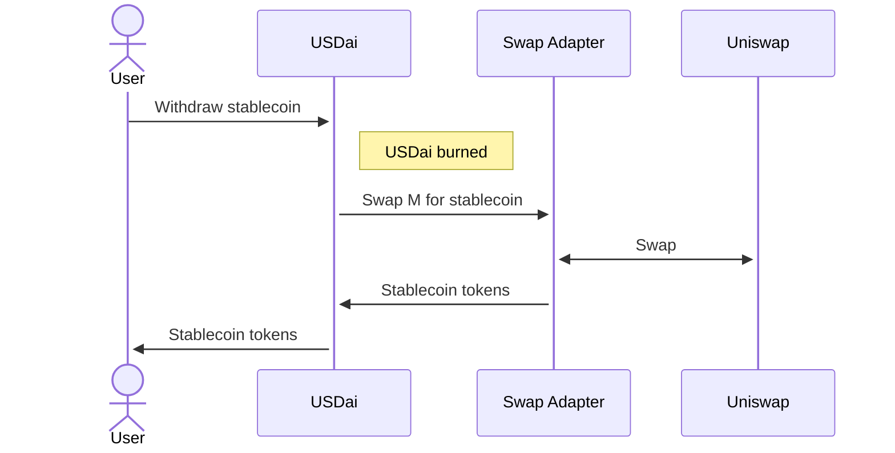
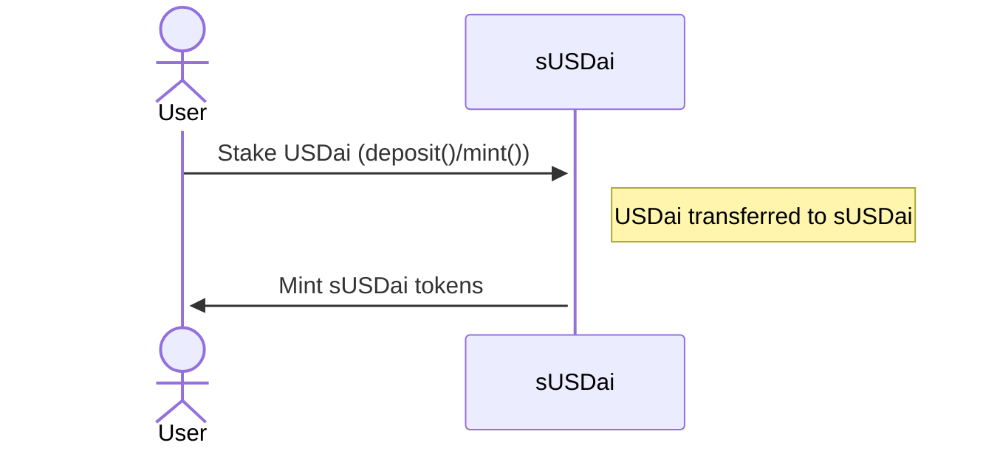
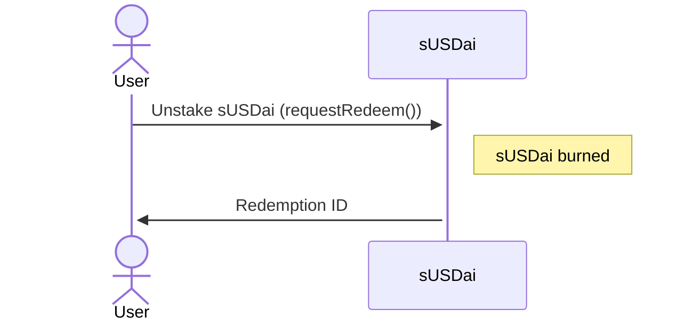
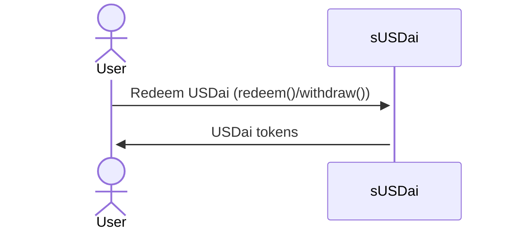
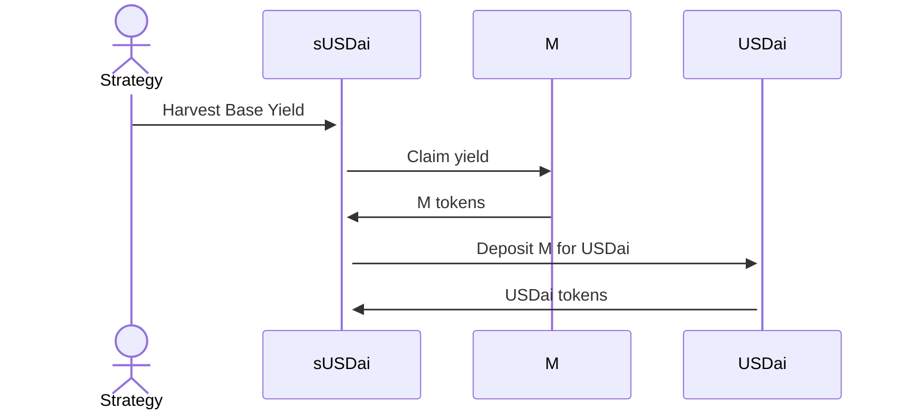
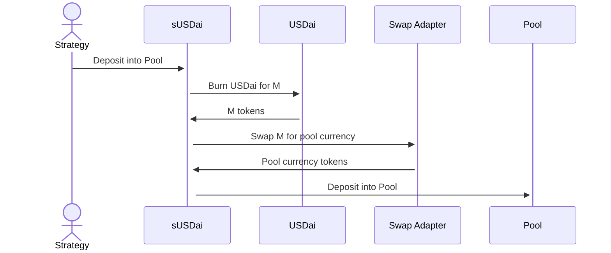
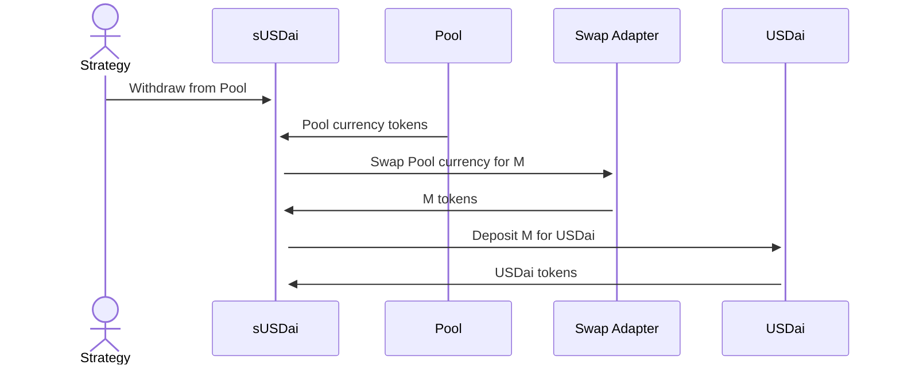

# USDai/sUSDai Design

## USDai

USDai is an [$M](https://www.m0.org/)-backed stablecoin. It is primarily used
as the on and off ramp to Staked USDai (sUSDai), but may offer other incentives
in the future.

### Minting

Users can mint USDai by depositing a supported stablecoin (e.g. USDC, USDT),
which is swapped internally for M.

```solidity
/**
 * @notice Deposit
 * @param depositToken Deposit token
 * @param depositAmount Deposit amount
 * @param usdaiAmountMinimum Minimum USDai amount
 * @param recipient Recipient
 * @param data Data (for swap adapter)
 * @return USDai amount
 */
function deposit(
    address depositToken,
    uint256 depositAmount,
    uint256 usdaiAmountMinimum,
    address recipient,
    bytes calldata data
) external returns (uint256);
```



### Burning

Users can burn USDai and withdraw a supported stablecoin.

```solidity
/**
 * @notice Withdraw
 * @param withdrawToken Withdraw token
 * @param usdaiAmount USD amount
 * @param withdrawAmountMinimum Withdraw amount minimum
 * @param recipient Recipient
 * @param data Data (for swap adapter)
 * @return Withdraw amount
 */
function withdraw(
    address withdrawToken,
    uint256 usdaiAmount,
    uint256 withdrawAmountMinimum,
    address recipient,
    bytes calldata data
) external returns (uint256);
```



### Swap Adapters

Swap adapters are responsible for swapping in and out of M with supported
currencies. Currently, the default swap adapter is the
[`UniswapV3SwapAdapter`](../src/swapAdapters/UniswapV3SwapAdapter.sol). Swap
adapters accept optional data to help facilitate swapping. In the case of the
`UniswapV3SwapAdapter`, the optional data specifies a path for the swap router
to swap tokens that do not have a direct swap market with M.

## sUSDai

Staked USDai (sUSDai) is a yield bearing ERC4626 (ERC7540 redeem) vault token
that earns yield from USDai M emissions and [MetaStreet Pool
loans](https://docs.metastreet.xyz/liquidity-layer/overview). USDai can be
staked for sUSDai, and later redeemed back for USDai. Unlike USDai, sUSDai is
not a stablecoin, but a free floating token, representing shares in an
assortment of targeted lending positions and unallocated USDai.

### Staking

Users can stake USDai to receive sUSDai at the current deposit share price.
Staking is a synchronous ERC4626 deposit operation.

```solidity
function deposit(uint256 assets, address receiver) external returns (uint256 shares);
function mint(uint256 shares, address receiver) external returns (uint256 assets);
```



Overloads for `deposit()` and `mint()` are provided with slippage protections
for EOAs.

### Unstaking

Users can unstake sUSDai to receive USDai at the current redemption share price.
Unstaking is an asynchronous ERC7540 redeem operation. Redemptions are subject
to a timelock (e.g. 7 days).

```solidity
function requestRedeem(uint256 shares, address controller, address owner) external returns (uint256 requestId);
function redeem(uint256 shares, address receiver, address owner) external returns (uint256 assets);
function withdraw(uint256 assets, address receiver, address owner) external returns (uint256 shares);
```





### Position Managers

The underlying asset held by the sUSDai vault is USDai, which is deployed and
harvested for yield with position managers. The
[`BasePositionManager`](../src/positionManagers/BasePositionManager.sol) is
responsible for harvesting M emissions for the M held in the USDai contract.
The [`PoolPositionManager`](../src/positionManagers/PoolPositionManager.sol) is
responsible for depositing and withdrawing from MetaStreet pools.

The `STRATEGY_ADMIN_ROLE` is required for harvesting yield and allocating the
USDai asset to and from pools. Currently, these operations are scheduled
offchain and executed by a multisig, but in the future will be an onchain
strategy with governance-driven parameters.

```solidity
/**
 * @notice Harvest yield from base token
 * @param usdaiAmount USDai amount
 */
function harvestBaseYield(
    uint256 usdaiAmount
) external;
```



```solidity
/**
 * @notice Deposit assets into a pool
 * @param pool Address of the pool
 * @param tick Pool tick
 * @param usdaiAmount Amount of USDai to deposit
 * @param poolCurrencyAmountMinimum Minimum amount of pool currency to deposit
 * @param minShares Minimum shares expected
 * @param data Data (for swap adapter)
 * @return shares Amount of shares received
 */
function poolDeposit(
    address pool,
    uint128 tick,
    uint256 usdaiAmount,
    uint256 poolCurrencyAmountMinimum,
    uint256 minShares,
    bytes calldata data
) external returns (uint256 shares);
```



```solidity
/**
 * @notice Withdraw assets from a pool after redemption
 * @param pool Address of the pool
 * @param tick Pool tick
 * @param redemptionId ID of the redemption
 * @param poolCurrencyAmountMaximum Maximum amount of pool currency to withdraw
 * @param usdaiAmountMinimum Minimum amount of USDai to withdraw
 * @param data Data (for swap adapter)
 * @return USDai amount
 */
function poolWithdraw(
    address pool,
    uint128 tick,
    uint128 redemptionId,
    uint256 poolCurrencyAmountMaximum,
    uint256 usdaiAmountMinimum,
    bytes calldata data
) external returns (uint256);
```



### Share Pricing

The net asset value of sUSDai is the combined value of unallocated USDai and
the value of its lending pool debt positions. Lending pool debt positions are
not guaranteed, as loans may default, so their value can be estimated
conservatively (in the case of default and liquidation), or optimistically (in
the case of repayment). Loans are assumed to be overcollateralized, so a
conservative estimate only includes the principal of loans, while an optimistic
estimate includes the principal plus real-time accrued interest of loans. As
loans are repaid, the interest is realized and compounded into the principal of
newly originated loans.

The deposit share price is computed from the optimistic net asset value, while
the redemption share price is computed from the conservative net asset value.
In general, the deposit share price is greater than or equal to the redemption
share price. If there are no active lending positions, they are equal.

Since the net asset value is denominated in USDai (backed by M), a price oracle
is needed to convert the lending pool position value, denominated in the pool
currency, back to USDai. [`IPriceOracle`](../src/interfaces/IPriceOracle.sol) provides this interface. The current
implementation, [`ChainlinkPriceOracle`](../src/oracles/ChainlinkPriceOracle.sol), uses Chainlink to price the exchange
rate of the lending pool currencies.

```solidity
/**
 * @notice Check if token is supported
 * @param token Token
 * @return True if token is supported, false otherwise
 */
function supportedToken(
    address token
) external view returns (bool);

/**
 * @notice Get price of token in terms of USDai
 * @param token Token
 */
function price(
    address token
) external view returns (uint256);
```

### Redemption Queue

Redemptions in sUSDai are managed with a FIFO queue, subject to a timelock
(e.g. 7 days). In the future, the redemption queue will implement a built-in
auction to bid on queue position.

Redemptions are serviced periodically by the `STRATEGY_ADMIN_ROLE`, as lending
positions may need to be unwound to provide sufficient USDai. This is currently
scheduled offchain to optimize for latency and capital distribution across the
lending pools. Once sufficient USDai is available, the strategy may call
`serviceRedemptions()` to process redemptions in the queue.

```solidity
/**
 * @notice Service pending redemption requests
 * @param shares Shares to process
 * @return Amount processed
 */
function serviceRedemptions(
    uint256 shares
) external returns (uint256);
```

## Omnichain Support

USDai and sUSDai support `burn()`/`mint()`-style omnichain token transfers.
This interface requires the `BRIDGE_ADMIN_ROLE`, which is granted to the token
messaging contract.

Support for LayerZero is available with [`OAdapter`](../src/omnichain/OAdapter.sol), which implements
the messaging endpoint, and the [`OToken`](../src/omnichain/OToken.sol), which implements an ERC20 of
the bridged representation.
